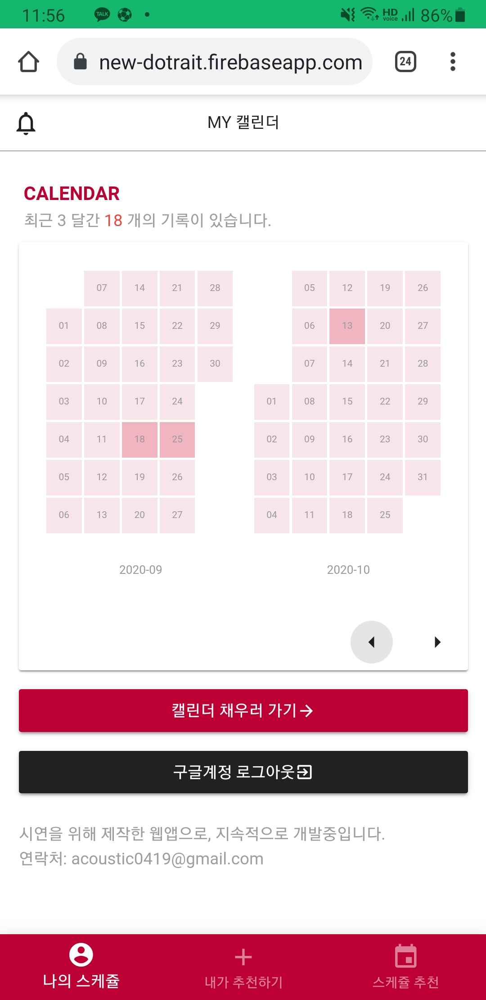
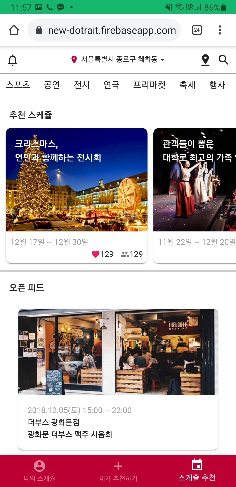
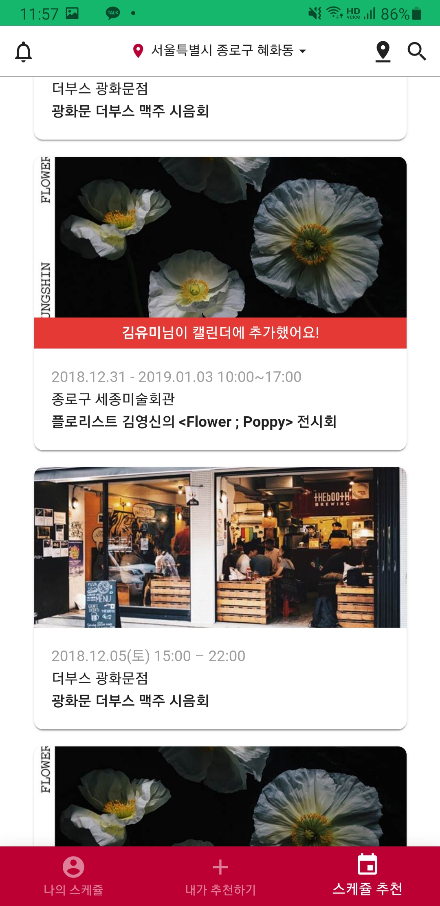
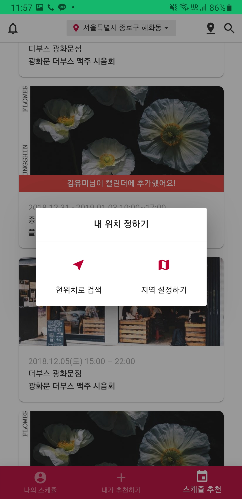
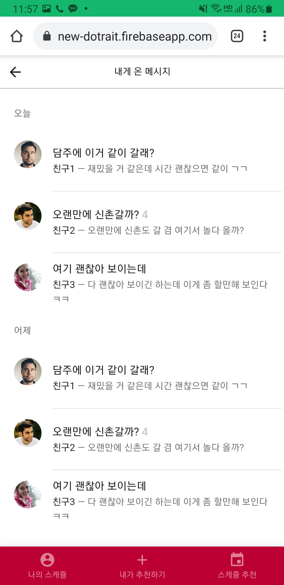

# dotrait-new
- 2018.07.26 ~ 2018.12.12
- 학생투표형 창업비즈니스 아이디어 출품작
- 프로토타입 주소: https://new-dotrait.firebaseapp.com/  (모바일 화면에 최적화되어 있습니다.)
- 1차, 2차가 있었으며, 이 레포는 2차 출품작 코드입니다. (1차 레포: https://github.com/kim-taewoo/dotrait)

## 사용 기술 스택
1. Vue
1. Google Calendar API(캘린더 연동)

## 캡쳐 이미지

|캘린더|피드|피드2|
|---|---|---|
||||

|위치설정|알림 및 채팅|
|---|---|---|
|||

## Build Setup

``` bash
# install dependencies
npm install

# serve with hot reload at localhost:8080
npm run dev

# build for production with minification
npm run build

# build for production and view the bundle analyzer report
npm run build --report
```

For a detailed explanation on how things work, check out the [guide](http://vuejs-templates.github.io/webpack/) and [docs for vue-loader](http://vuejs.github.io/vue-loader).
